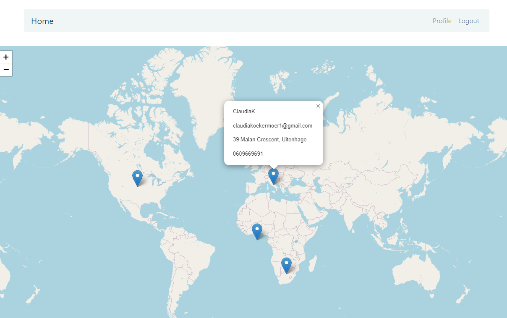
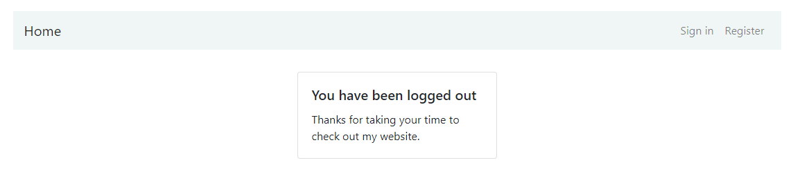
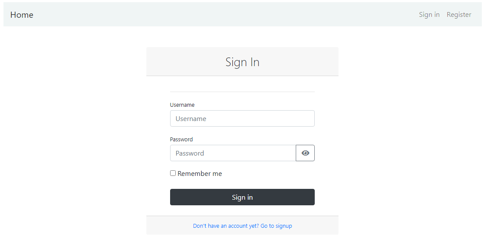
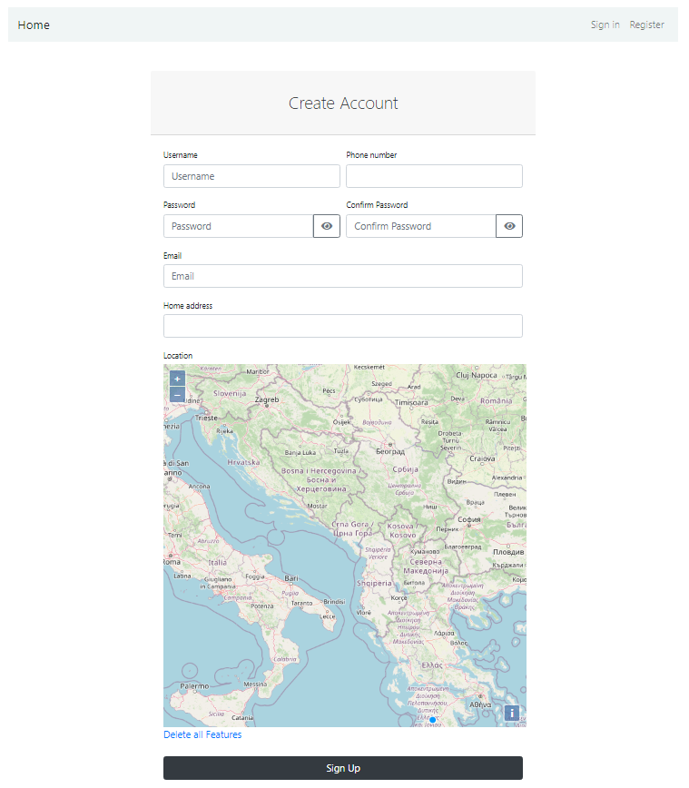
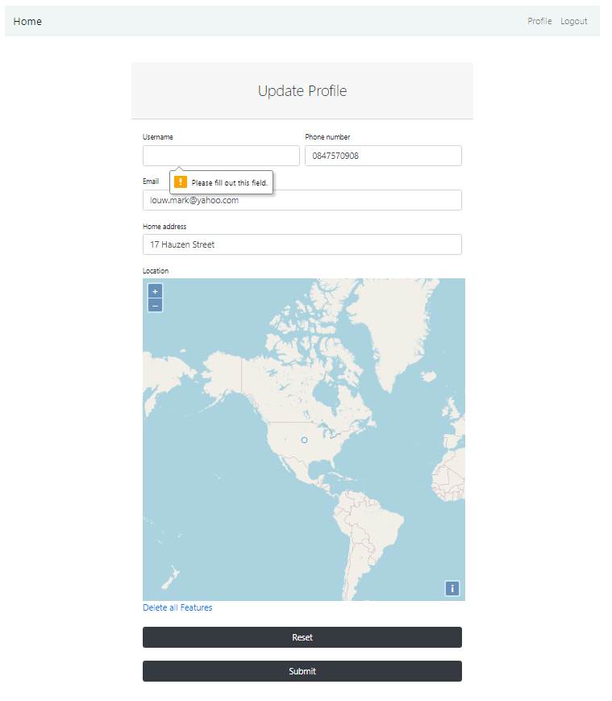

# django-gis-user-map
 An example user management system that shows user locations on a map

 ## Starting the Django application

In a new terminal tab:

1. Install the back-end requirements in the environment of your choice:
  ```shell
  $ sudo apt-get install binutils libproj-dev gdal-bin libsqlite3-mod-spatialite gdal-bin sqlite sqlite3
  $ cd /path/to/repo/
  $ python3 -m pip install -r requirements.txt
  ```
2. Create a file called .env in the root of the project and add a secure secret key
```
SECRET_KEY = 'django-insecure-n@wv__z^5_irkzrcjr_e=2c64twi#5lf=t7$3yn-f0%aqwuci8'
```
3. Create the initial Django database by running migrations:
  ```shell
  $ python manage.py migrate
  ```
4. Create a Django superuser:
  ```shell
  $ python manage.py createsuperuser
  ```
5. Run the Django project (by default on port 8000):
  ```shell
  $ python app/manage.py runserver
  ```

## Running tests
```
flake8  . --exclude=migrations,venv,settings.py
python app/manage.py test app/
```

## Linting fix up
```
autopep8 --in-place --aggressive 
```
## Screenshots




